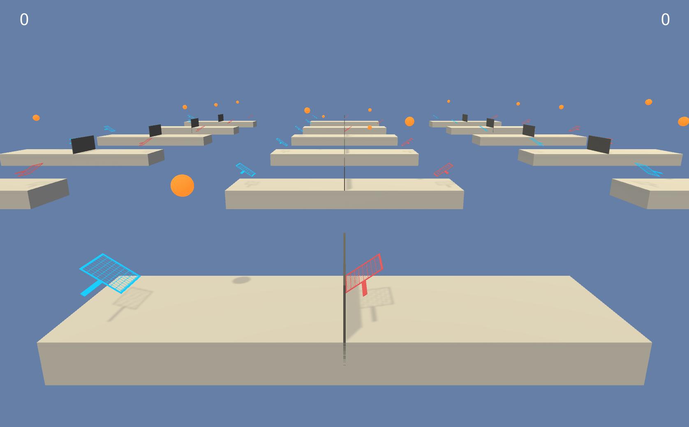
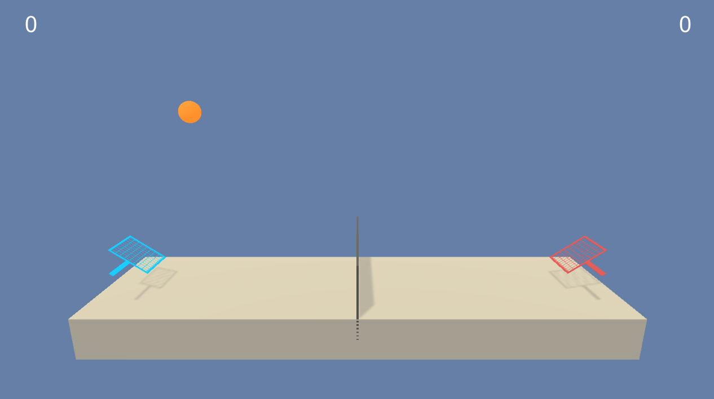

# DRLND-Project3
DRLND Project 3 - Collaboration and Competition (Tennis environment)


The notebook and Python files in this repository present a solution using the Unity ML-Agents **Tennis** environment as customized by Udacity for the third project of the Udacity [Deep Reinforcement Learning Nanodegree](https://www.udacity.com/course/deep-reinforcement-learning-nanodegree--nd893) (July 2018).

## Project Details

The *state space* for this project consists of 8 continuous values representing the position and velocity of a racket and ball in the X-Y plane.

The *action space* is a vector with two continuous values, clamped between -1 and 1, corresponding to the X and Y movements of the racket in the game, where the goal is to move the racket so it collides with the ball in a manner that causes the ball to move over the net, but not "go out" (collide with the back of the court area). 

Code for the Unity **Tennis** agent can be viewed [here](https://github.com/Unity-Technologies/ml-agents/blob/master/UnitySDK/Assets/ML-Agents/Examples/Tennis/Scripts/TennisAgent.cs)

The image below shows the Unity version of the environment with 18 games (36 agents):



And the single court version with 2 agents from Udacity looks like this:



A reward of +0.1 is provided for each step that the agent's shot goes over the net and not out, while a penalty of -0.01 for any failed shot or when the ball collides with the floor.

The environment is considered solved when the agents have an average score of +0.5 (over 100 consecutive episodes, after taking the maximum over both agents).

## Getting Started

#### Install the Anaconda distribution of Python 3

[Anaconda Python](https://www.anaconda.com/download/#macos) installation.

#### Obtain Unity ML-Agents

Install [Unity ML-Agents](https://github.com/Unity-Technologies/ml-agents/blob/master/docs/Installation.md) and [NumPy](http://www.numpy.org/).

## Instructions

#### Start Jupyter and open the Tennis notebook

```
> jupyter notebook
```

The notebook, **Tennis.ipynb**, can then be opened.

The **Tennis environment** used for this project was supplied by Udacity for Max (OSX) via [this link](https://s3-us-west-1.amazonaws.com/udacity-drlnd/P3/Tennis/Tennis.app.zip).

Select **Cell > Run All**.

## Additional Resources

Need more links? Visit [http://bit.ly/drlndlinks](http://bit.ly/drlndlinks) to learn much more about DRLND and Reinforcement Learning.