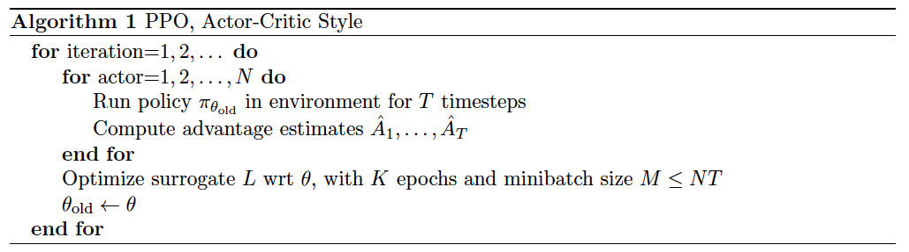
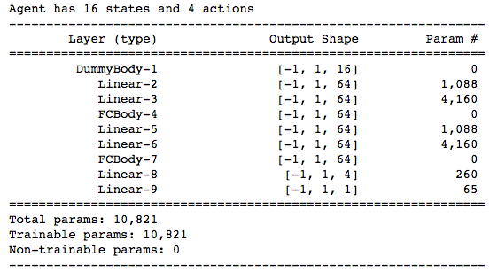
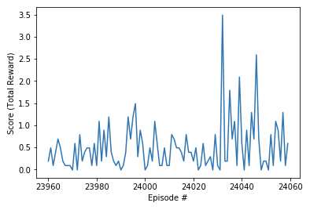
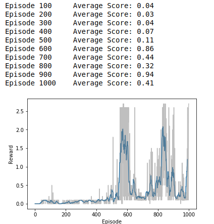

# DRLND-Project3 Report
DRLND Project 3 - Collaboration and Competition (Tennis environment)

## Learning Algorithm

The learning algorithm implemented for this project is a proximal policy optimization (PPO) algorithm described by Schulman et al in [Proximal Policy Optimization Algorithms](https://arxiv.org/abs/1707.06347) as one that "strikes a favorable balance between sample complexity, simplicity, and wall-time" by alternating between sampling interactions with the environment, and optimizing a “surrogate” objective function using stochastic gradient ascent.



Specifically, this implementation of this algorithm used the modular deep reinforcement learning framework **DeepRL** from [Shangtong Zhang](https://shangtongzhang.github.io/) on [github](https://github.com/ShangtongZhang/DeepRL). The DeepRL framework allows the defination of **Tasks**, configuration of **Agents** and provides an instrumented loop for running training episodes.

The solution Jupyter notebook, **Tennis.ipynb**, contains the definition of the *TennisTask* class, configuration of a *PPOAgent* and a customized run loop.

#### Hyperparameters

```python
    config.discount = 0.99
    config.use_gae = True
    config.gae_tau = 0.95
    config.gradient_clip = 5
    config.rollout_length = 2048
    config.optimization_epochs = 10
    config.num_mini_batches = 32
    config.ppo_ratio_clip = 0.2
    config.log_interval = 2048
    config.max_steps = 2e7
```

These hyperparameters were copied unchanged from the example *ppo_continuous* configuration of the DeepRL **examples.py** script ([lines 393-417](https://github.com/ShangtongZhang/DeepRL/blob/master/examples.py)). 

#### Model Architecture

The **Actor** in the framework's *GaussianActorCriticNet* is a mapping of state to action values via fully connected **Linear** layers with **tanh** activation (line 151 of [network_heads.py](https://github.com/ShangtongZhang/DeepRL/blob/master/deep_rl/network/network_heads.py)). The final output layer yields 4 values. 

The **Critic** is a value function, measuring the quality of the actions via fully connected **Linear** layers with the final layer yielding the single output value.

Unfortunately, running a *torchsummary.summary* for the (actually separate) Actor-Critic networks produces a conflated schematic, which suggests there is only the single output value of the Critic (from layer *Linear-9*), when in fact there are also the 4 output values of the Actor net (from layer *Linear-8* below):

 

 "State", in the sense of what-is-true-in-the-environment-now, in this model is different from the "observed state" of 24 values per agent returned by the Tennis environment. As noted in the notebook, observed state *repeats* (stacks) the prior two states (accounting for 16 values), so only the final 8 of the 24 values observed for each agent are actually the **state** at each step. These 8 values for the two agents are concatenated to present a 16 value state vector to the network. 

## Plot of Rewards


Final 100 rewards:



As illustrated above, the environment was solved in 24,060 episodes.

## Ideas for Future Work

While it was educational to exercise the DeepRL framework to create a deep reinforcement learning model which surpassed the target average score of +0.5 over 100 episodes using a single **PPO** agent with a concatenated input (on the understanding that *which* agent received the action and returned a reward would alternate between *odd* and *even* steps within the environment), the Udacity DRLND Slack #project-3_collab-comp channel included reports, such at the one below (1), which solved the environment in 40x fewer episodes (600 versus over 24,000) using "2 independent DDPG agents".

Neither this PPO solution nor the DDPG solution appear to be particularly robust, however, with some episodes ending with negative scores. Future work should delve into why the agents are failing to make those first shots and determine whether it is feasible to re-engineer the reinforcement learning model to learn how to initiate a rally, even when the racket is out of position and headed the wrong way as the episode starts. 

Then, there is lots more to study at [http://bit.ly/drlndlinks](http://bit.ly/drlndlinks)!

---

(1) DDPG result by **Gregorio Mezquita**, shared on [Udacity DRLND Slack](https://drlnd.slack.com/archives/CBP0LNTTQ/p1539936282000100):

